# Voice Programming with Alexa
### Amazon Echo - An amazing and serendipitous product

---

## What is an Amazon Echo?
### (For folks living under a rock)

---

> "Kinda like the result of a one night stand between Siri and a Bose speaker"

---

### When it was first announced...

## It seemed like a really stupid idea

#### Just read all the HN comments calling it DOA

^And it was around the time of the Fire phone too

---

> Isn't it just a Siri? Great it isn't even portable

---

> Who needs another AI that can't do anything but tell time, check weather, set alarms?

---

## I was also one of them, but still got a beta unit anyway...
### ($99 and a 6 month wait :disappointed:)

---

## You only realize it's a game changer after using it

---

# Superb voice recognition
### Picks up your voice easily across the whole room

---

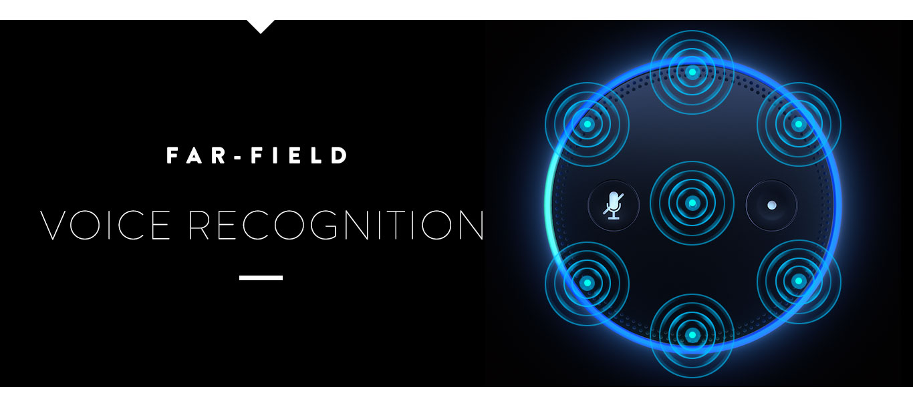

---

# Fixed location
### It's part of your apartment, it's always there in the same place

---

# The simple stuff matters the most
### Checking weather, setting alarms and playing music.

---

# Ask and you shall be given
### Syntax driven, so what?

^Ultra gratifying when something works consistently

---

- Ninja snoozing the alarm eyes closed then asking Alexa for the time without opening my eyes
- Getting a weather update before heading out
- Turning off the lights and TV, cooking timers, sleep timers
- Prime music, audible, spotify
- Connecting to the iPhone and voice controlling it
- Daily pregnancy updates

---

# Demo Video

---

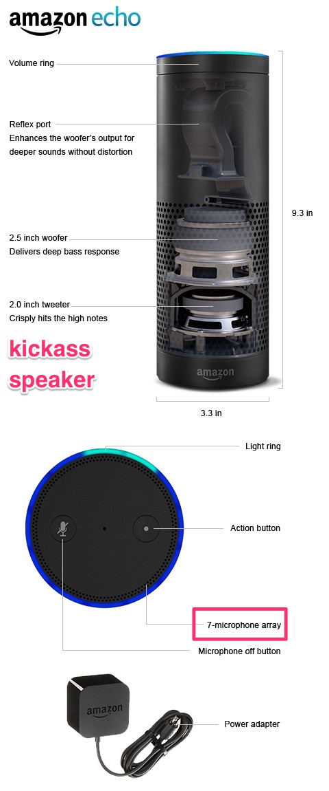

## Amazon Echo

- The original device
- $179+
- Great speaker that easily fills an apartment
- Runs on an adapter

---

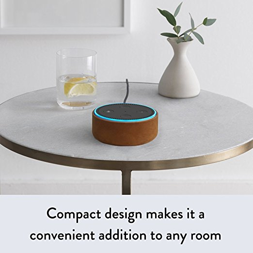

## Echo Dot
- $49.90
- Same voice recognition technology
- Small internal speaker
- Powered by micro USB

---

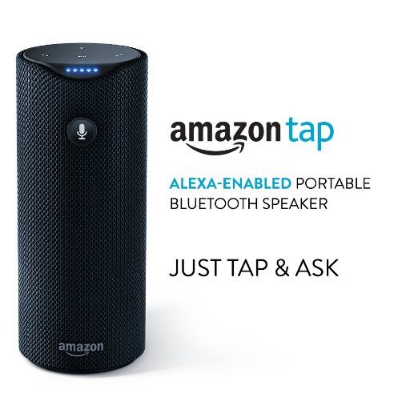

## Echo Tap
- $129.99
- Portable, battery powered
- Tap and speak :(
- I think it's a prototype for other manufacturers who want to integrate Echo

---

# What can developers do with Alexa?

---

# Alexa Voice Service
### Expose Alexa in your app or hardware

---

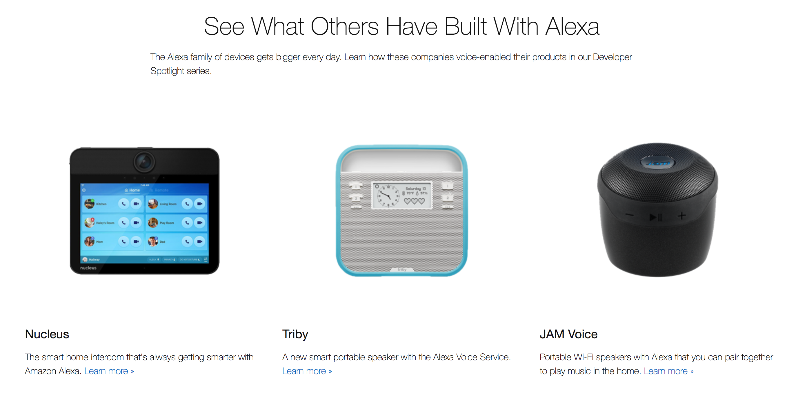

^Speaker manufacturers trying to enter the smart speaker game using AVS

---

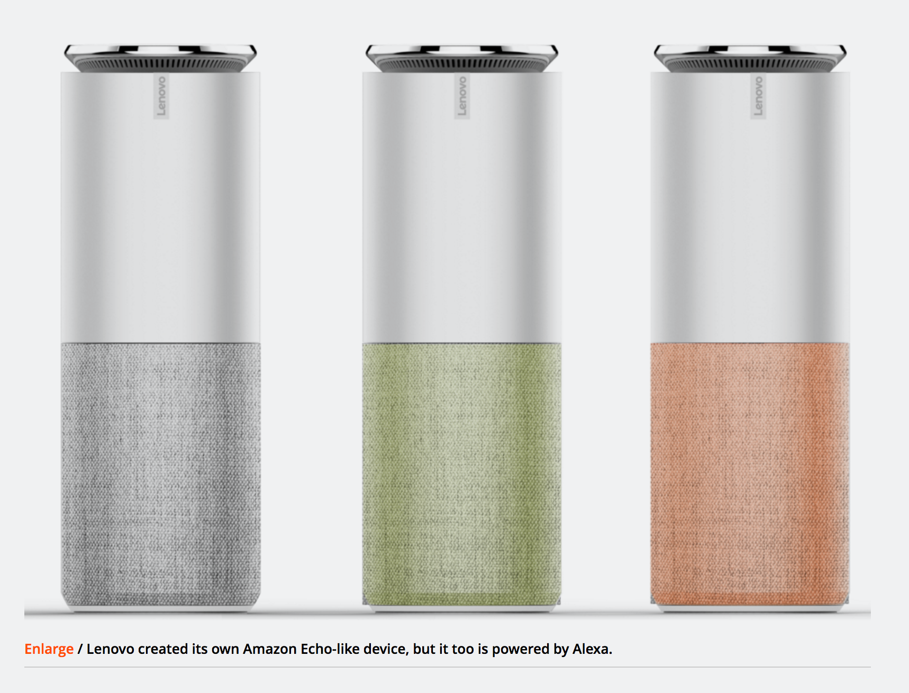

^Lenovo making an Alexa clone actually running Alexa???

---
From Arstechnica: I have seen the future: Alexa controls everything
> LG's new smart fridge, for instance, is an ideal home for Alexa. Fridges are always on, have a natural spot in one of the busiest rooms in the home, and—if you subscribe to Amazon Fresh at least—you can place an order the moment you discover month-old milk hiding at the back.
-- Mark Walton

^I am in agreement on how natural it is to get Alexa to do something at the moment you want

---

# Alexa Skills Kit

### Extend Alexa's capabilities programmatically

---

# Flash Briefing Skill
### "Alexa, give me my flash briefing"

---

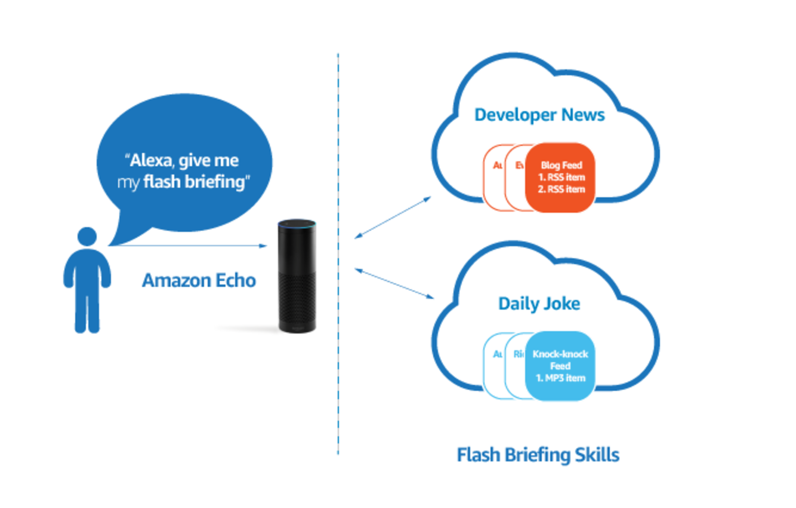

^Returning a feed type item with a singular command

---

# Smart Home Skill
### "Alexa, turn on bedside lights"

^For smarthome app makers and manufacturers to integrate their offerings
^Usually less useful for developers because most smart home systems don't have an internet enabled API by default
^Avoids needing to say ask <skill> to do something
^Access to device groups

---


- Lights and TV (using Harmony for IR control)
- Prime music integration + sleep timers are awesome
- Can hear you across the room even when it's starting to play music
- The everything off switch has been really useful

---

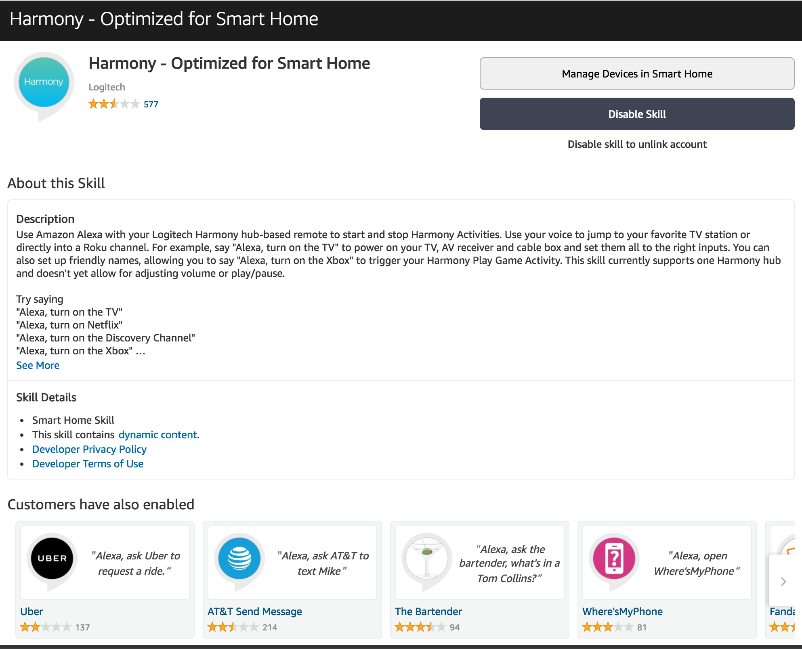

---

# Custom Skills

---

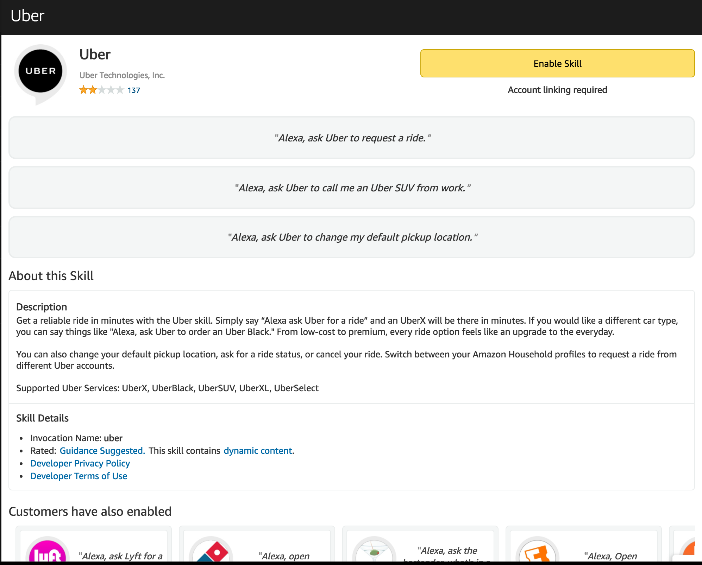
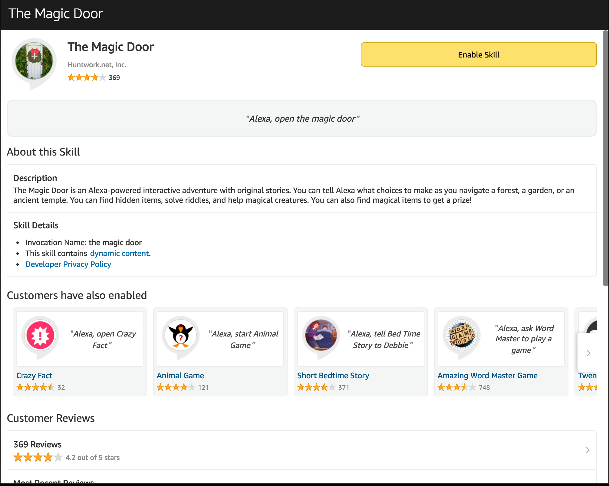

---

## By the way, Alexa APIs available are available in UK and Germany

---


## We're going to use the ASK to build a custom skill today

---

# Eva


---

## No, the evil version


---

# Creating a skill

### [Amazon Developer Portal](https://developer.amazon.com)

---


### "Alexa, ask Eva to sing Stephanie a song"

---

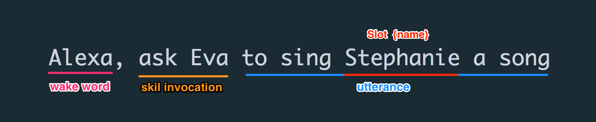

^Our skill is called Eva, we can use tell / ask / open to invoke it.
^There's no difference between tell and ask, just to make the invocation more natural

---

# The Interaction Model

---

# Invocation Name
### "Tell / Ask <Eva> to do something"
### "Open <Eva>"

---

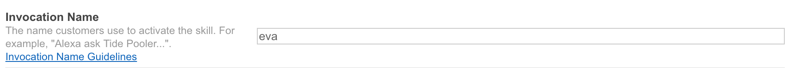

### Note: Amazon doesn't like one word invocation name, unless it's your trademark

---

# Utterances

### Mapping what you say to the skill to a function

---

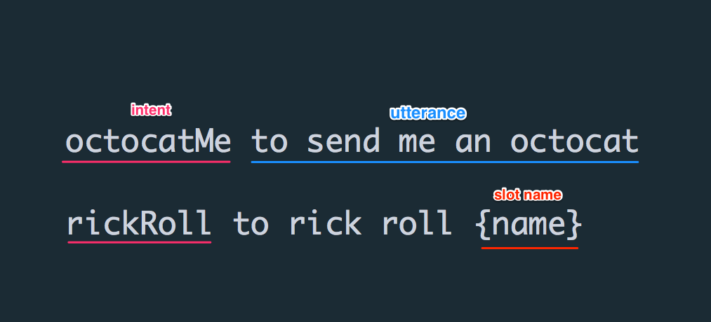

---

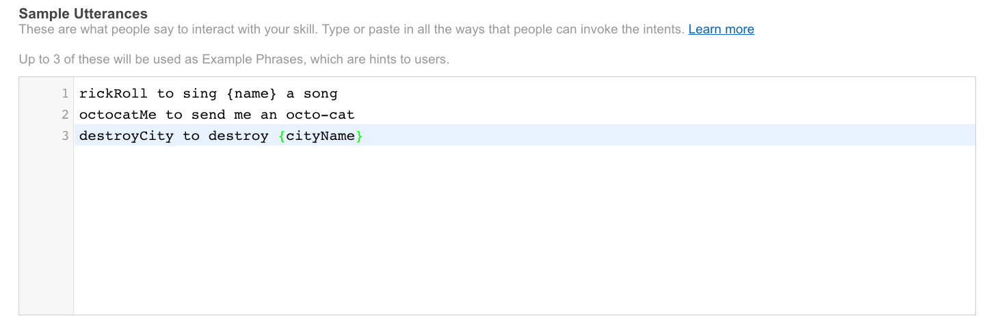


---

# Slots
### Interpolating dynamic values in speech

---

### This is where the magic happens
- Slots are interpolated values. Example: send a gift to `{nameOfPet}`
- But have a `type` that helps Alexa understand possible values.
- Built-in vs Custom Types

---

## Very useful slot types

- `AMAZON.DATE` => 'Third Febuary, 1st day of next year, 3 days from now' into a date field
- `AMAZON.TIME` => 'Noon, midnight, 14 hundred hours, 6 A.M.' into a time field
- `AMAZON.DURATION` => 'for 3 hours, 130 seconds altogether' itno a duration field
- `AMAZON.FOUR_DIGIT_NUMBER` => '1 o 2 6'

The basic helpers are great enablers for most apps

---
## Growing number of built in types

- `AMAZON.Movie` => Alien, Star Wars
- `AMAZON.SoftwareApplication` => Angry Birds, box of cats, pokemon go, tinder
- `AMAZON.US_STATE` / `AMAZON.GB_REGION` => Recognizes NYC, big apple etc

Yes, some of these are camel cased, some constantized. Why? I have no eye deer. [List of Slot types](https://developer.amazon.com/public/solutions/alexa/alexa-skills-kit/docs/built-in-intent-ref/slot-type-reference)

---

## Built in slot types handle natural language nuances
### Highly recommended over custom slots

---

## Custom Slots
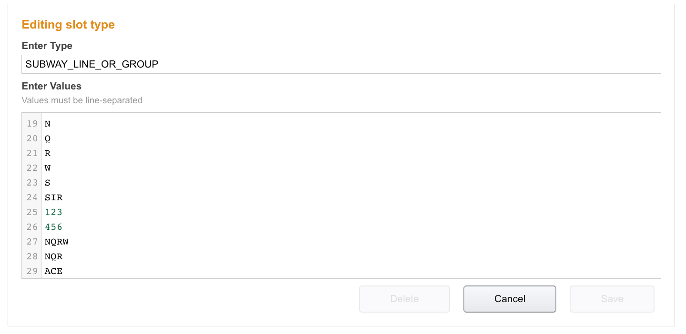
Great when you need a specific list of values

---

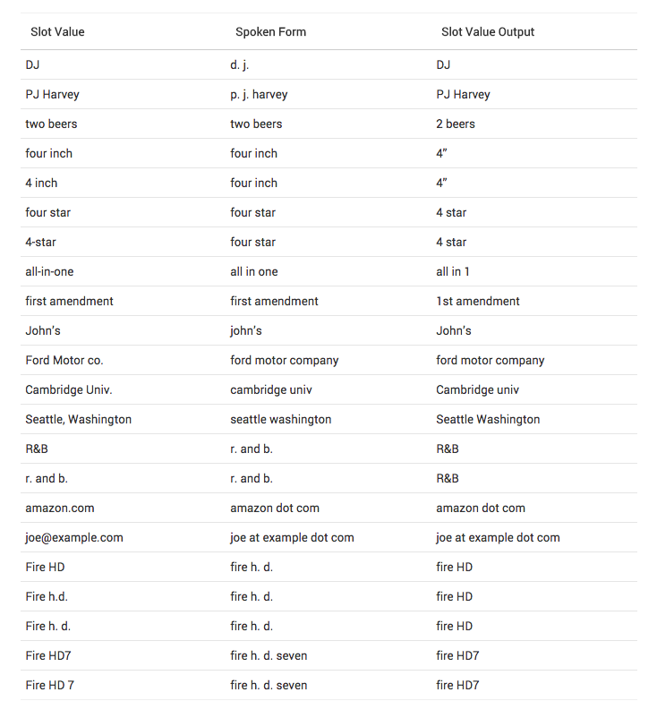
There are specific ways to define [slot values](https://developer.amazon.com/public/solutions/alexa/alexa-skills-kit/docs/alexa-skills-kit-interaction-model-reference)

---

# The Intents Schema
### Bringing it all together

---

```json
{
  "intents" : [{
    "intent": "rickRoll",
    "slots": [
        {
          "name": "firstName",
          "type": "AMAZON.US_FIRST_NAME"
        }
      ]
    },
    {
      "intent": "octocatMe",
      "slots": []
    },
    {
      "intent": "destroyCity",
      "slots": [
        {
          "name": "cityName",
          "type": "AMAZON.US_CITY"
        }
      ]
    }
  ]
}
```

---

# The request response model

---

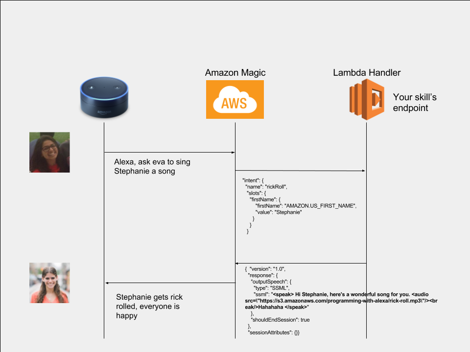

---

## Use a Lambda or HTTPS endpoint

### Lambdas highly recommended

---

## Why Lambda
- Because we all love Node and JS
- Lambda [Free](https://aws.amazon.com/lambda/pricing/) Tier == 1 million free requests
- The model fits custom skills API perfectly. Event driven, only get charged while the lambda is running

#### :bulb: Why don't we make Speak go serverless?

---

# The Alexa Node SDK
### A [lifesaver](https://github.com/alexa/alexa-skills-kit-sdk-for-nodejs)

#### (Integration with DynamoDB for persistence)

---

# Live coding
### (The part you regret after but keep forgetting :smirk:)

---

# SSML
### Speech Synthesis Markup [Language](https://developer.amazon.com/public/solutions/alexa/alexa-skills-kit/docs/speech-synthesis-markup-language-ssml-reference)

---
# Looks like HTML

- <s>Hello</s> => Sentence. Or use full stops.
- <say-as="spell-out">ACE</say-as> => Says 'A, C, E'. Or use a. c. e.
- <phoneme> => Provide a way to provide the phonetic pronunciations

---

# Testing
- Lambdas are pretty easy to test locally, the events sent by Amazon are very predictable
- Example [tests](https://github.com/daemonsy/mta-status/blob/master/tests/index-test.js#L30) on MTA Status
- No CLI to set utterances or slots other than the dev portal. I save them and test locally

---

# Testing Tools

- Test SSML responses
- Fire events to your lambda
- Have skill enabled on your Echo

---

# Advanced Concepts

- Cards
- Link account
- Session attributes and persistence
- Using built in [intents](https://developer.amazon.com/public/solutions/alexa/alexa-skills-kit/docs/built-in-intent-ref/built-in-intent-library) over custom ones

---

## The future in `<speak/>`

---

# Imagine...

- Indistinguishable Voice Synthesis - [Google DeepMind](http://www.theverge.com/2016/9/9/12860866/google-deepmind-wavenet-ai-text-to-speech-synthesis)
- Might even be able to sing... :scream:

---

# Applications?
- Virtual doorman, drive through ordering bot
- A composer can test his songs easily
- Instant translations
- Carry out therapy
- Interactive stand up commedy?

---

## And what if this was all accessible to you via an API?

---

# Make a custom skill, it's fun!

### (I'm doing one for the MTA's subway status)

---


---

# Thank you

---

# P.S.

- It was fun to work on Lambda using Node, be nice if there's easy to use CLI to push changes
- AVA.js was quite a nice experience, nice to use one library for all testing
- Amazon got testing tools right for once, on the Alexa development interface. Easy to get started!

---

# Links & Notes

- [MTA Status Skill](https://github.com/daemonsy/mta-status)
- [Destruction Soundbites](http://soundbible.com/tags-destruction.html)

---
